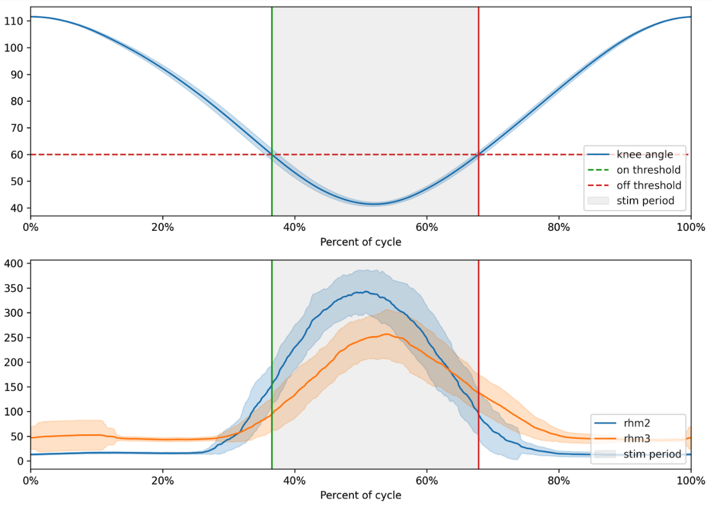

I joined <a href="https://edgeanalytics.io">Edge Analytics</a> February 2020. Edge is a boutique data science consulting company. As a small group of data scientists and engineers, we bring years of experience in delivering elegant solutions to complex, ambiguous problems. We help our partners turn ideas into reality.

  

    

    

    <!--
    

    -->
  

Since joining, I've worked on projects ranging from drug therapeutic discovery to human movement augmentation using precision bionics hardware to the next generation of consumer wearable products. I feel lucky to work on challenging projects that have real world positive impacts with an excellent team. The problems are engaging and complex, but I've found developing relationships with team members and clients to be the most rewarding aspect of working with Edge.

In addition to delivering results for our clients, I've also pushed to integrate new software tools at Edge that span a number of projects. A few platforms that have been particularly helpful are <a href="https://mlflow.org">MLFlow</a> and <a href="https://beam.apache.org/">Apache Beam</a>. We use MLFlow to track and organize datasets, models, and computational experiments by their parameters and resulting metrics. Gone are the days of manually recording computational experiments in a spreadsheet! We use Beam to parallelize data processing jobs that are otherwise too cumbersome to brute force with for loops or spin up with multithreading. Beam has helped us achieve 100x speed ups in data processing pipelines.

