

  

    

    
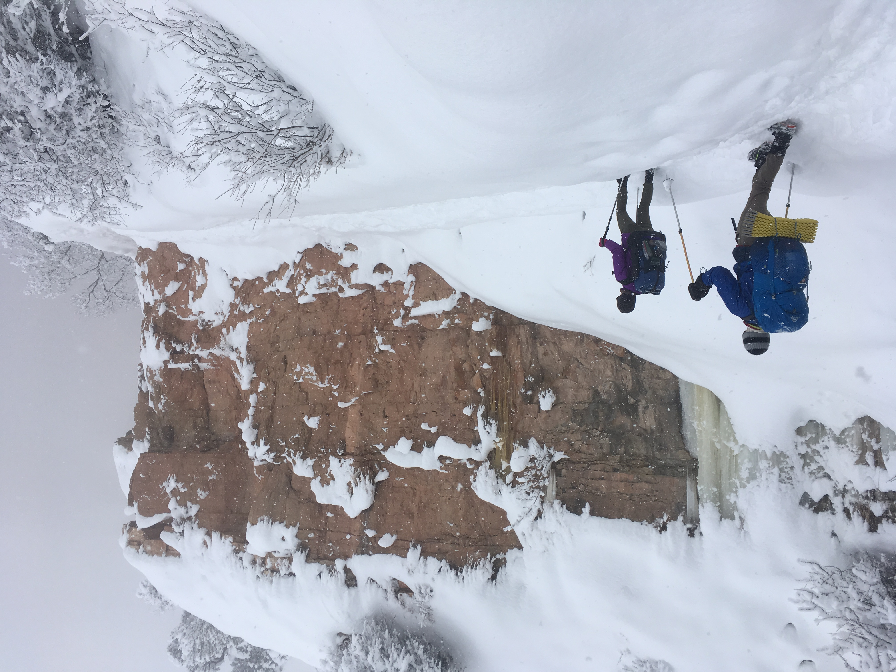

    
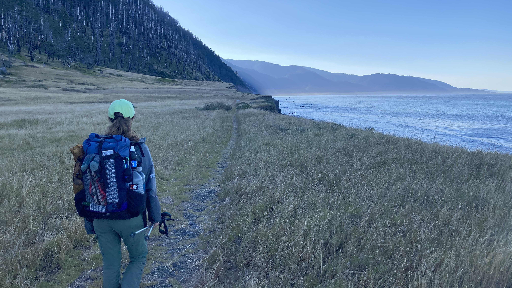

  

I grew up in a family that instilled in me an appreciation for spending time outdoors. Growing up, this usually manifested itself in weekend trips to a family cabin built by my great grandparents in the western flank of Uinta Mountains in Northern Utah. Over time, I found myself preferring to be on the move outdoors rather than spending the day around a camp fire, which got me into backpacking.

    

        
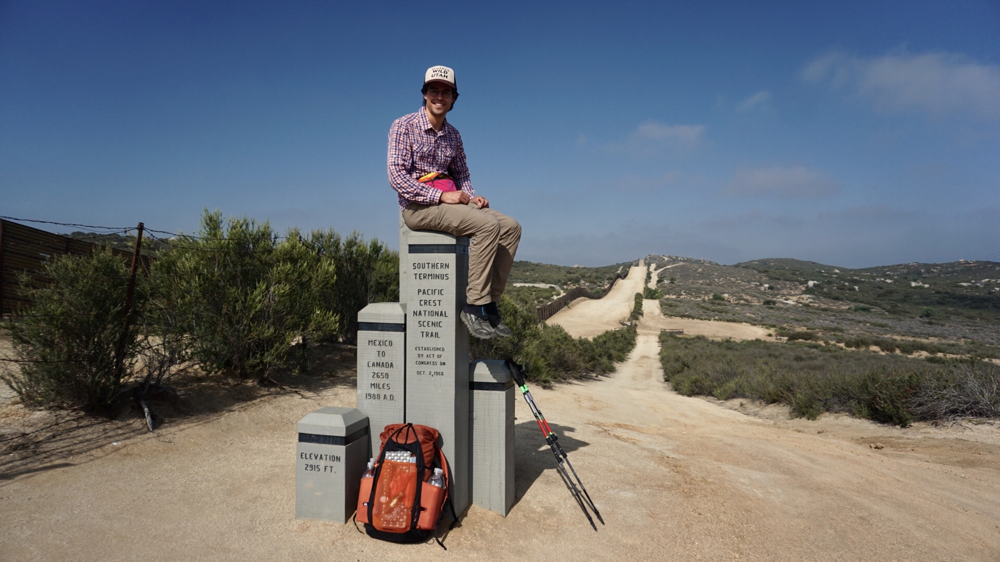

        
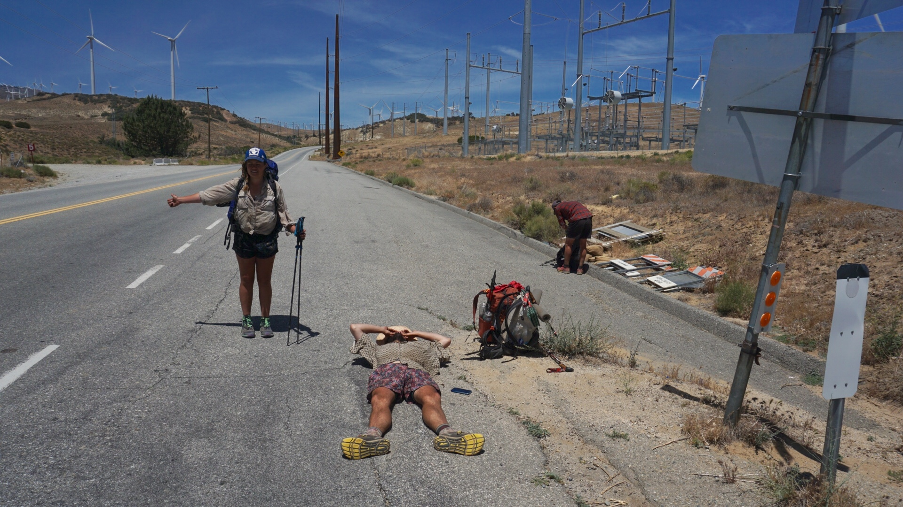

        
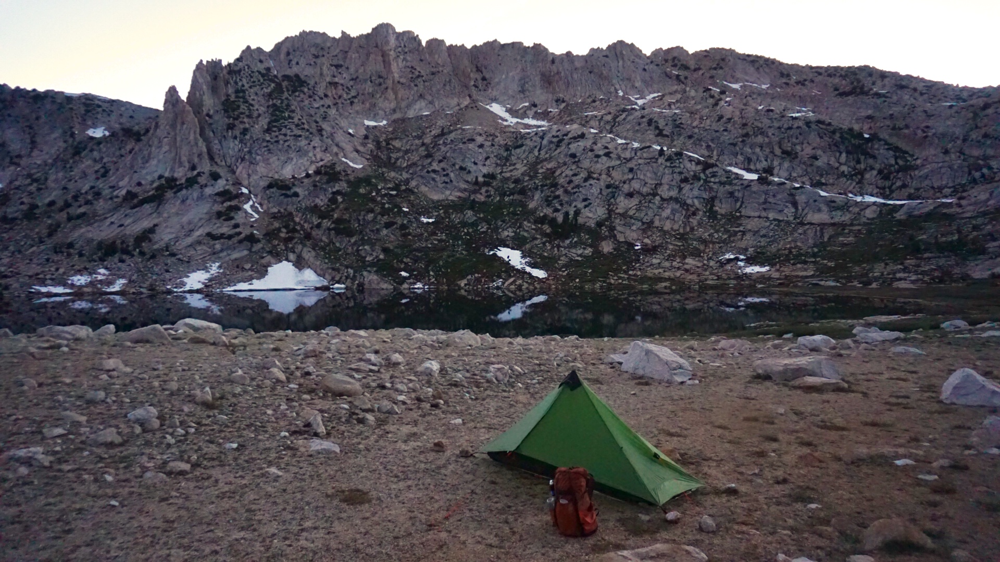

        <!-- Break -->
        
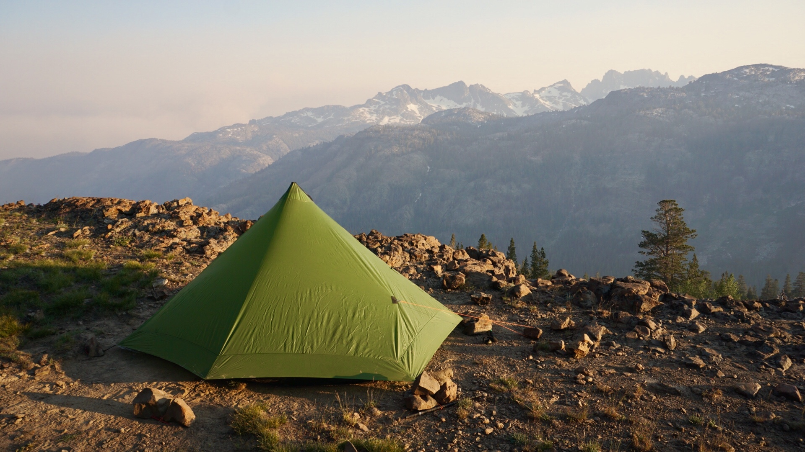

        
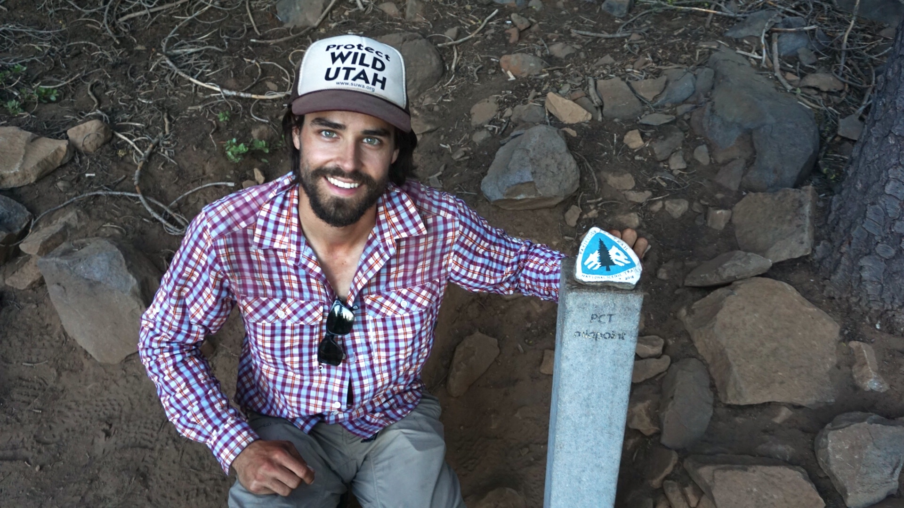

        
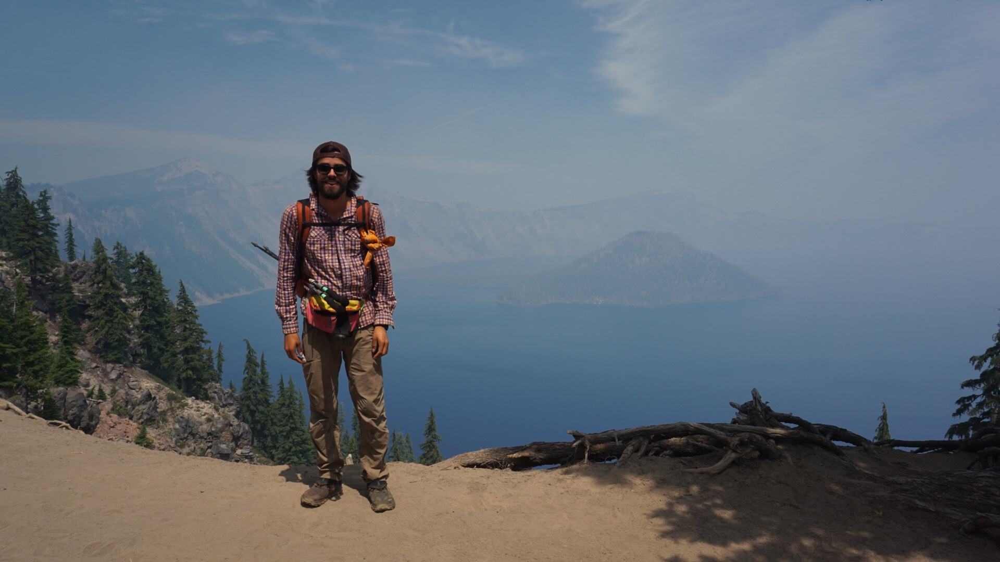

        <!-- Break -->
        
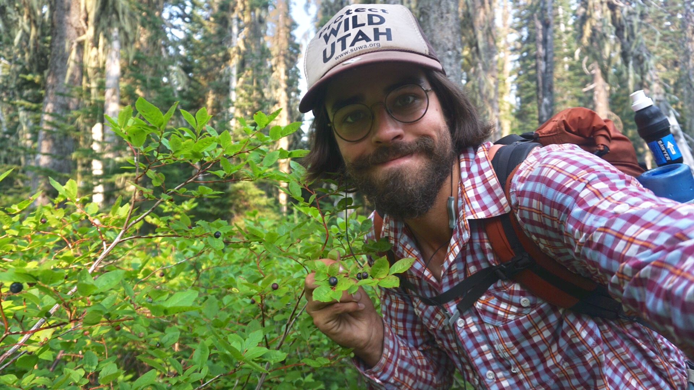

        
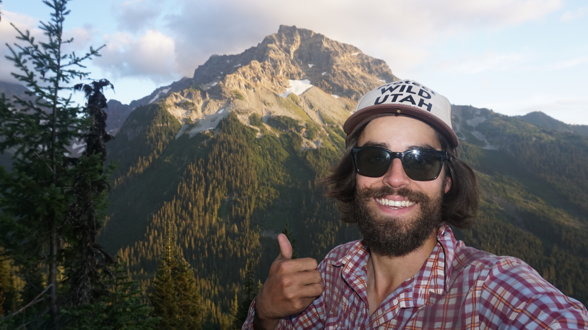

        
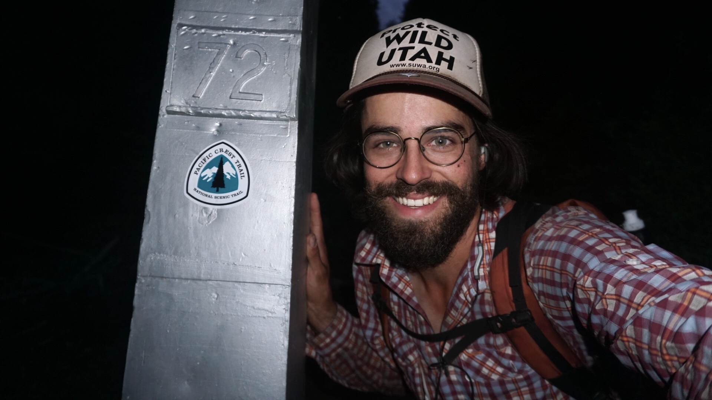

    

I have done a bunch of trips over the years in the desert, in the mountains, on the coast. My biggest trip by far, however, was hiking 2,600 miles on the Pacific Crest Trail in 2018. The pictures above do a pretty good job describing the feel of watching California, Oregon, and Washington wilderness and towns roll by underfoot. I wrote extensively about the trip on my <a href="https://rengibbons.wordpress.com/">WordPress blog</a> with daily updates. I am particularly fond of <a href="https://rengibbons.wordpress.com/2018/09/06/day-100-august-26-miles-2518-2518-peed-in-a-bottle/">this post</a> where I got stuck in a thunder storm in remote Northern Washington for 48 hours and had to wait it out in my tent. Overall, the trip was transformative and has left me hoping to do a similar trip in the not too distant future.
