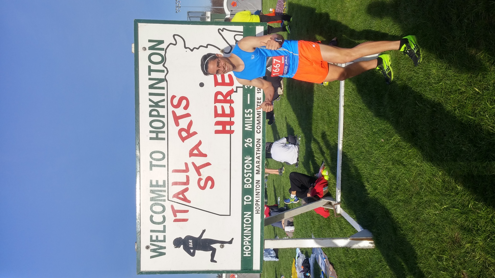
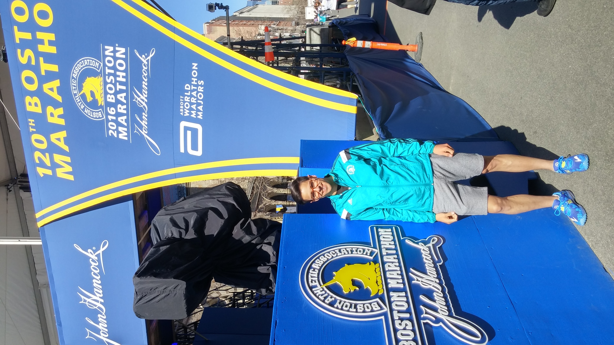
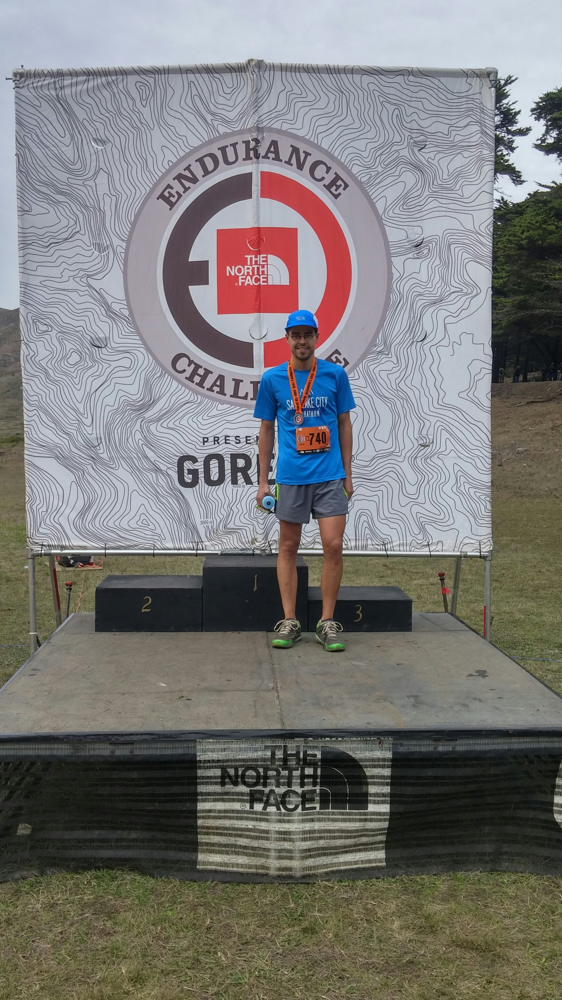

  

    

    

    

  

I really love running. Once upon a time, I was more competitive and dedicated about running fast. In recent years, it has become more of a hobby, and I'm typically a hesitant about overuse injuries. This is not an unfounded worry, as I'm currently battling another round of pesky plantar fasciitis.

I hit my peak (to date) running stride in 2015/2016. I ran my PR marathon time (2:49) at the <a href="https://www.strava.com/activities/510638779">Napa Valley Marathon</a> in 2016. A few weeks later, I ran <a href="https://www.strava.com/activities/549522298">Boston Marathon</a> where I was trying to run 2:45. The weather was cloudless and hot with a healthy headwind. These factors slowed me down quite a bit.

Despite dabbling in road marathons a bit, trail running has always appealed to me more than road. Back in 2015, I ran the <a href="https://www.strava.com/activities/446854391">North Face 50 Miler</a> in Marin. I still have aspirations to run 100 miles one day, but small injuries here and there tend to interupt those plans. Here's an unfortunately short <a href="https://ultrasignup.com/m_results_participant.aspx?fname=Ren&lname=Gibbons">list</a> of trail runs I can claim.

