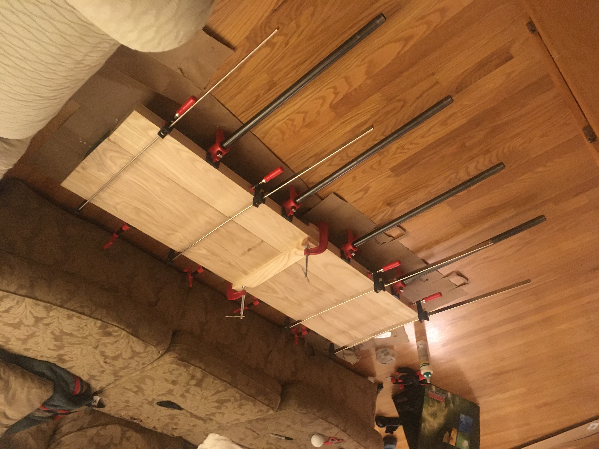
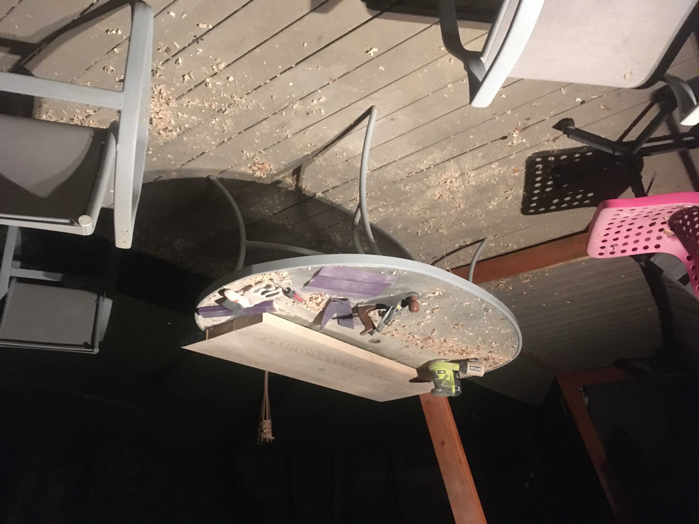
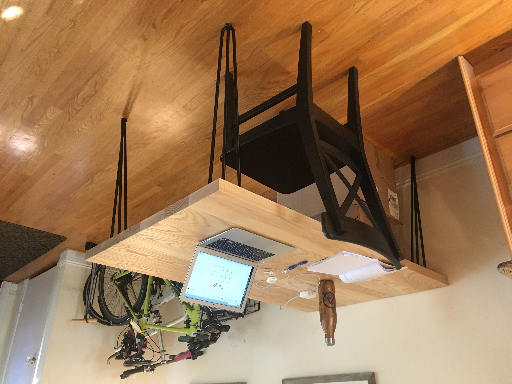
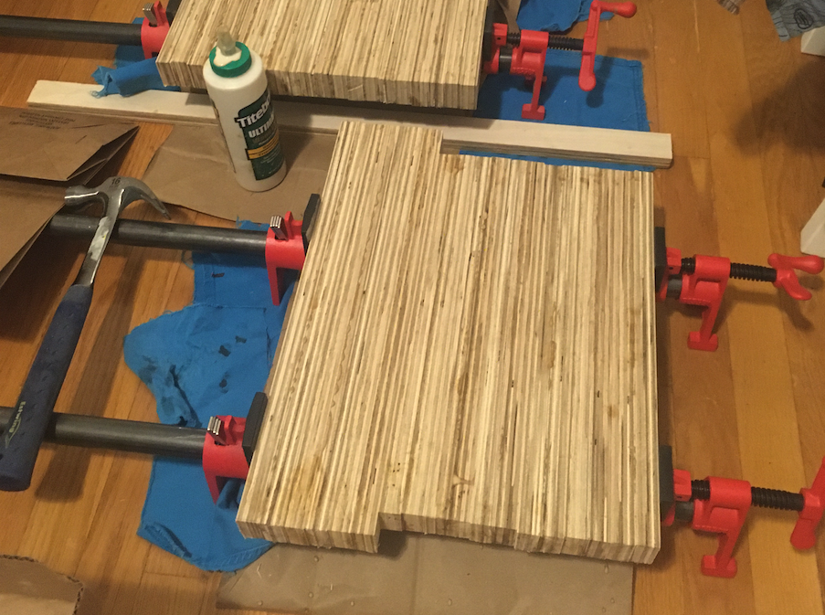
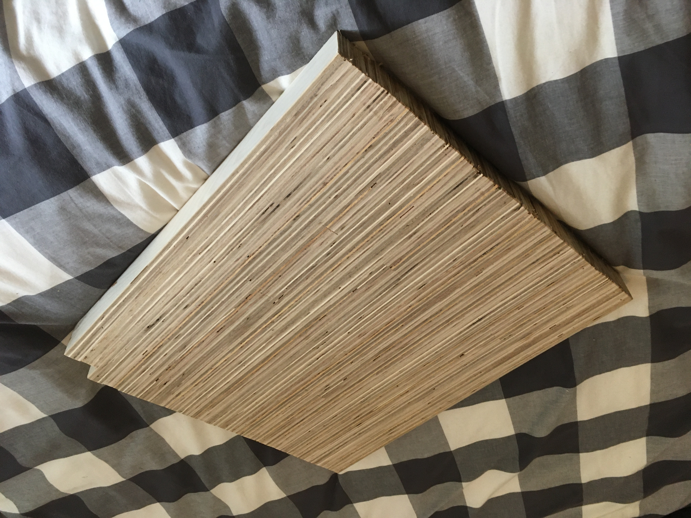

I recently started woodworking. I didn't own any tools, and I didn't have any formal training. I didn't have access to a woodshop, and I didn't have much space since I was renting a room in a house. I knew I'd have to choose projects that I could do with limited tools.

My first project was a dining table. This was my simplest project to date but also the highest stakes since 8/4 ended up costing more than I was expecting ($300 in lumber). In theory, this project is straight forward. I would buy the lumber premilled to s4s, and the remaining steps would be far from rocket science.

<ol>
    <li>Glue the boards together.</li>
    <li>Cut the ends square.</li>
    <li>Sand all surfaces smooth.</li>
    <li>Finish with a couple layers of polyurethane.</li>
    <li>Bolt hairpin legs to the bottom..</li>
</ol>

In practice, the project was much more difficult that this. I learned that buying milled lumber comes with no quarantee of straightness. By the time I had the lumber home, each plank was warped by at least a few millimeters. Given these boards are nearly 2" thick, it is extremely difficult to clamp the warp out during the glue up. I ended up with a glued table top with unevenly glued planks. With a mill, I'd be able to shave the unevenness off in a few seconds, but I only had sandpaper. After many nights of sanding, the table was smooth by feel and mostly flat. Once I was happy with the smoothness, I finished the surface and attached the legs.

  

    

    

    

  

My next project was probably over ambitious given my resources, but I convinced myself I was capable of making a set of chairs. There's a woodworking aesthetic that's become quite popular on YouTube where plywood is cut into thin slices and strips are glued on their face to expose the layers.

Working with plywood would give me more control of the medium since I wouldn't have to rely on someone else's milling, and it would reduce stress levels since plywood is inexensive. Most of all, I knew the chairs would look beautiful if they turned out properly.

I didn't document the process of making these chairs too well, unfortunately, but I did walk away having learned some important lessons. When gluing strips, always cut them longer than you need, and cut them to exact length latter. Don't buy the least expensive jig saw at Home Deport. You will not be satisfied with your results if you attempt the make exact length cross cuts with a circular saw - just buy a miter saw. The most important lesson, though, was sometimes, you need to take a break to blow off steam.

After a month of work, I finished the chairs. Overall I am amazed that they are actually functional chairs, and I think they look really nice. They are holding up very well after six months of daily use.

  

    

    

    

  

